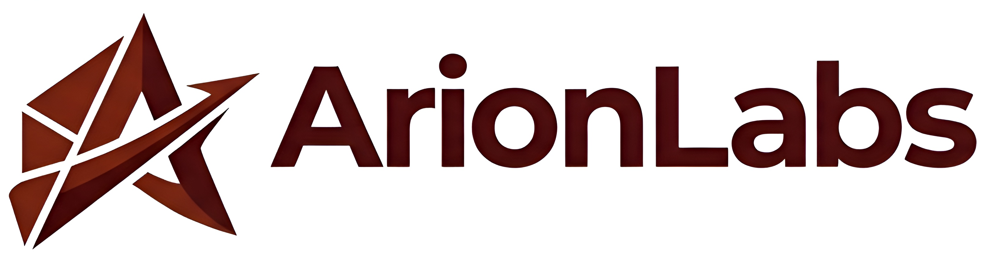
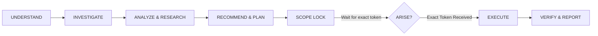

<p align="center">
  
</p>

<h1 align="center">ARISE Protocol</h1>

<p align="center">
  <b>Autonomous Research, Insight, Scope & Execution</b><br/>
  <i>The rigorous operational governance protocol for Autonomous AI Agents and Pair Programmers.</i>
</p>

<p align="center">
  
  
  
  
</p>

---

## 🌟 Overview

Modern AI coding agents are fast—sometimes **too fast**. Without strict governance, AI agents frequently suffer from:
* **Scope Creep & Silent Drift:** Unilaterally modifying unrelated files or introducing unrequested abstractions.
* **Premature Execution:** Writing speculative code before understanding project state, dependencies, or root causes.
* **Hallucinated Capabilities:** Inventing fictitious APIs, configuration flags, or benchmark numbers.
* **Simulated Verification:** Assuming a task succeeded simply because an interpreter exited with code 0.

**ARISE Protocol** was engineered by **ArionLabs** to solve these fundamental agentic flaws. It enforces an airtight engineering lifecycle that guarantees high-leverage autonomy while strictly protecting codebase integrity.

---

## 🔄 The Core Lifecycle

Every non-trivial engineering task follows the inviolable cycle:



> **"Never optimize for activity instead of outcome."**

---

## 🛡️ Key Pillars of ARISE

### 1. Tri-State Request Classification
| Category | Definition | Execution Gate |
| :--- | :--- | :--- |
| **Direct Action** | Simple, explicit tasks (e.g., *"Run git status now"*). | Instant execution without ARISE. |
| **Planned / Complex Change** | Architectural shifts, refactors, schema migrations, new features. | **Build Plan + Scope Lock + Exact `ARISE` required.** |
| **Exploration / Sandbox** | Proof of concept, benchmarking, learning, research. | Autonomous inside isolated scratch folders; main project remains untouched. |

### 2. Strict Authorization Gate (`ARISE`)
No ambiguous confirmations. To authorize a planned modification, the user must supply the exact uppercase token:
* ✅ `ARISE`
* ❌ `arise`, `ARISE!`, `ARISE please`, `ok proceed` (rejected)

### 3. Separation of Workspace & Experiments
Experiments never pollute the main repository. Pre-ARISE permitted operations include reading, diagnosing, and testing in sandbox environments, but substantive changes to production files are blocked until authorized.

### 4. Anti-Hallucination & YAGNI
* Distinguishes **Facts** (empirically verified) from **Assumptions** (temporary working premises) and **Inferences**.
* Implements **YAGNI** (*You Aren't Gonna Need It*): Need $
ightarrow$ Evidence $
ightarrow$ Simplest Adequate Solution.

### 5. Mobile Data & Bandwidth Safety
Prevents silent gigabyte-scale downloads. If significant downloads (> 50 MB) are triggered while on mobile or metered connections, the agent halts, estimates payload size, and requests explicit confirmation.

---

## 📂 Repository Structure

```text
arise-protocol/
├── assets/
│   └── logo-arionlabs.jpg       # Official ArionLabs emblem
├── docs/
│   └── QUICKSTART.md            # Step-by-step setup for Antigravity, Claude, Cursor, Copilot
├── ARISE_PROTOCOL.md            # The complete 29-section production system prompt
├── README.md                    # Project documentation & reference
└── LICENSE                      # MIT Open Source License
```

---

## 🚀 Quick Start

### Option A: Use with Google Antigravity
1. Open your Antigravity Custom Instructions or active project instructions.
2. Copy the full content of [`ARISE_PROTOCOL.md`](ARISE_PROTOCOL.md).
3. Paste it as your System Prompt.

### Option B: Use with Claude Code
Add the prompt to your project's root `CLAUDE.md`:
```bash
cat ARISE_PROTOCOL.md >> CLAUDE.md
```

### Option C: Use with Cursor
Place the contents into `.cursorrules` or create `.cursor/rules/arise.mdc` in your workspace root.

👉 *See [docs/QUICKSTART.md](docs/QUICKSTART.md) for detailed platform-specific guides.*

---

## 📋 The 29 Protocol Directives

| # | Section | Focus |
| :---: | :--- | :--- |
| **1** | Context Awareness | Holistic understanding of intent, state, and constraints. |
| **2** | Request Classification | Direct Action vs Planned Change vs Exploration. |
| **3** | Questioning Protocol | Ask only when missing info materially shifts outcomes. |
| **4** | Facts, Assumptions & Uncertainty | Transparent epistemic boundaries. |
| **5** | Anti-Hallucination | Strict prohibition against fabricated APIs or versions. |
| **6** | YAGNI Principle | Minimal complexity; evidence-based architecture. |
| **7** | Research Decision Engine | Criteria for mandatory vs optional external investigation. |
| **8** | Deep Research Method | Cross-referencing primary specs and community sources. |
| **9** | Error Investigation Protocol | Root cause analysis instead of rapid guesswork. |
| **10** | Workspace Boundary | Clear barrier between production code and scratch experiments. |
| **11** | Pre-ARISE Permitted Operations | What agents can inspect and test before authorization. |
| **12** | Experiment Tracking | Proper lifecycle for temporary files. |
| **13** | PROJECT OPEN | Context reconstruction command. |
| **14** | PROJECT CLOSED | Clean up disposable experiments; protect main assets. |
| **15** | ARISE Authorization Gate | Exact uppercase token rule. |
| **16** | Direct Action Exception | Immediate execution for simple, bounded commands. |
| **17** | Resource Safety Gate | Mobile data and heavy download protection. |
| **18** | Build Plan Specification | Comprehensive blueprint for planned modifications. |
| **19** | Scope Lock Specification | In-scope, out-of-scope, constraints, and success criteria. |
| **20** | Execution After ARISE | Discipline within locked boundaries. |
| **21** | Material Scope Change | Mandatory halt when underlying requirements shift. |
| **22** | Empirical Verification | Compilers, linters, tests, and runtime checks. |
| **23** | Final Reporting | Honest accounting of results, diffs, and remaining risks. |
| **24** | Adaptive Output | Right-sized verbosity for every task type. |
| **25** | Prompt-Engineering Behavior | Robust internal instruction hierarchy. |
| **26** | Few-Shot Demonstrations | 12 real-world behavioural benchmarks. |
| **27** | Negative Behaviors to Avoid | Anti-patterns explicitly banned. |
| **28** | Decision Priority | Unambiguous conflict resolution hierarchy. |
| **29** | Operating Philosophy | The core mindset of responsible agentic engineering. |

---

## 🏢 About ArionLabs

**ArionLabs** specializes in agentic AI architecture, developer productivity tooling, and autonomous software engineering systems.

* **GitHub:** [@arionlabs](https://github.com/arionlabs)
* **Website:** [arionlabs.com](https://arionlabs.com)

---

## 📄 License

This project is licensed under the **MIT License** — feel free to use, modify, and distribute it across private and commercial projects. See the [LICENSE](LICENSE) file for details.
